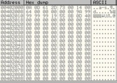
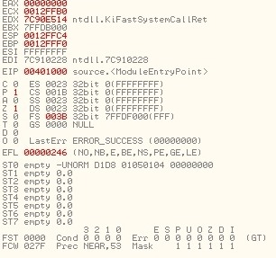
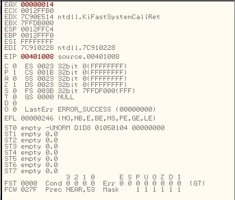
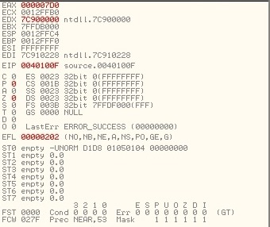
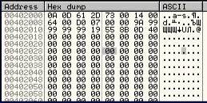

Cегмент данных содержит:

### Пошаговое выполнение программы

Состояние регистров до работы программы:

**XOR EAX, EAX**: Код команды 33С0. Результат выполнения будет равен 0 при любом значении EAX, тем самым мы обнулим регистр.

**MOV AX,WORD PTR DS:[402006]**: Код команды 66:A1 0620400. Команда MOV копирует данные из сегмента данных по указателю 402006 в младшие байты регистра EAX - AX. Результат работы операции:

**MUL WORD PTR DS:[402008]**:Код команды 66:F725 082040. Команда MUL берет 2 операнда, первый задается неявно и зависит от размера второго операнда. Регистр с результатом определяется кодом операции и размером множителей. В данном случае явный операнд размером WORD соответственно первым множителем является регистр AX а результат хранится в DX:AX.

**MOV DWORD PTR DS:[40200A],EAX**: Код команды A3:0A204000. Копирование данных из регистра EAX  в сегмент данных по адресу 40200A.

