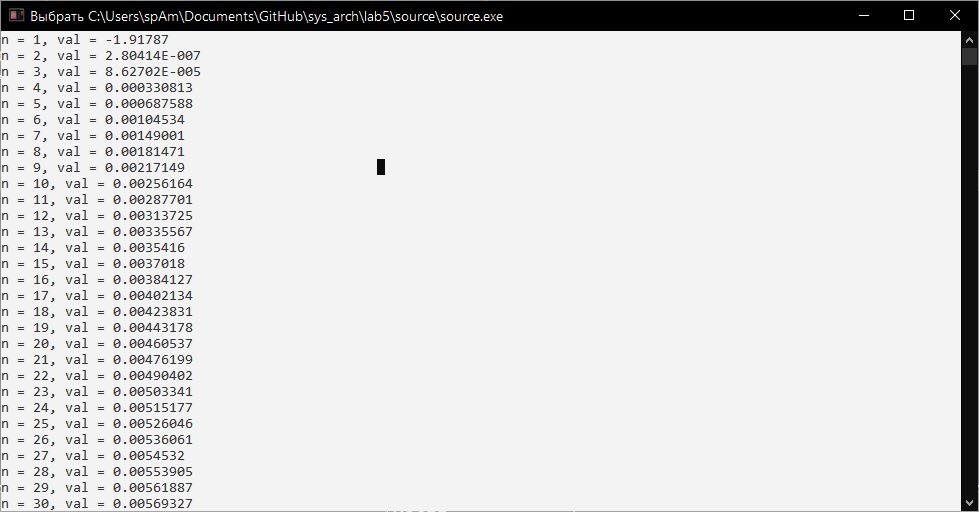

$$S = \sum_{n=1}^{\infty} \frac{\arcsin{\frac{1}{n}}}{q^{n+1}} + \frac{\arcsin{\frac{2}{n}}}{q^{2n+1}}, q=\sqrt[3]{5} $$

| Возводимая степень | Число              | Результат          |
|--------------------|--------------------|--------------------|
| 7                  | 15.785882283611476 | 244276685.97512513 |
| 4                  | 12.397380786333002 | 23622.16850557444  |
| 5                  | 1.5547164190911074 | 9.083556575710105  |
| 10                 | 8.152607336313801  | 1297075493.1452634 |
| 2                  | 8.149783655406079  | 66.41897362992407  |
| 8                  | 10.432880896495366 | 140356973.6460661  |
| 8                  | 2.98295215209596   | 6268.596229167466  |
| 6                  | 1.538308962780702  | 13.251389593189709 |
| 3                  | 1.6246359823133498 | 4.288132568321104  |

