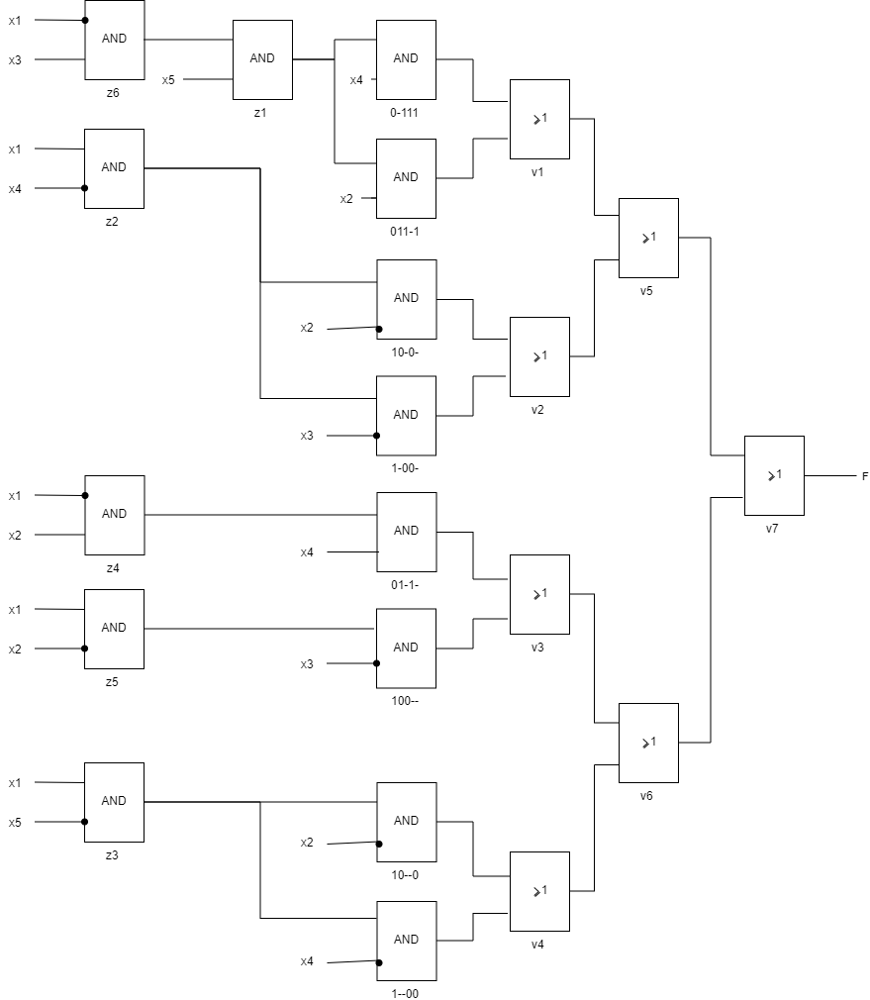
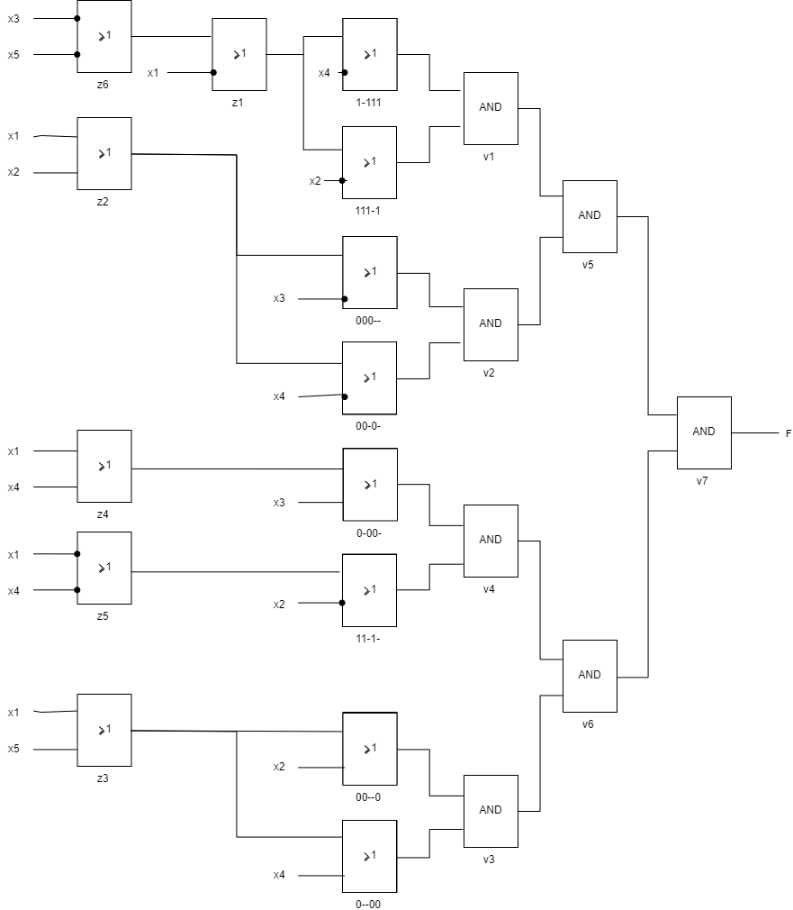

Дана функция $$3<( x_4x_5 + x_1x_2x_3)<8 $$

Построем таблицу истинности.

  №    $x_1x_2x_3x_4x_5$    f
---  -------------------  ---
  1                00000    0
  2                00001    0
  3                00010    0
  4                00011    0
  5                00100    0
  6                00101    0
  7                00110    0
  8                00111    1
  9                01000    0
 10                01001    0
 11                01010    1
 12                01011    1
 13                01100    0
 14                01101    1
 15                01110    1
 16                01111    1
 17                10000    1
 18                10001    1
 19                10010    1
 20                10011    1
 21                10100    1
 22                10101    1
 23                10110    1
 24                10111    0
 25                11000    1
 26                11001    1
 27                11010    0
 28                11011    0
 29                11100    1
 30                11101    0
 31                11110    0
 32                11111    0

**Получение минимальной дизъюнктивной нормальной формы булевой функции.**

**СДНФ**

№       $x_1x_2x_3x_4x_5$  Простая импликанта?
----  -------------------  ---------------------
[8]                 00111
[11]                01010
[12]                01011
[14]                01101
[15]                01110
[16]                01111
[17]                10000
[18]                10001
[19]                10010
[20]                10011
[21]                10100
[22]                10101
[23]                10110
[25]                11000
[26]                11001
[29]                11100

**Импликанты первого порядка** 

№         $x_1x_2x_3x_4x_5$    Простая импликанта?
--------  -------------------  ---------------------
[8, 16]   0-111                *
[11, 12]  0101-
[11, 15]  01-10
[12, 16]  01-11
[14, 16]  011-1                *
[15, 16]  0111-
[17, 18]  1000-
[17, 19]  100-0
[17, 21]  10-00
[17, 25]  1-000
[18, 20]  100-1
[18, 22]  10-01
[18, 26]  1-001
[19, 20]  1001-
[19, 23]  10-10
[21, 22]  1010-
[21, 23]  101-0
[21, 29]  1-100
[25, 26]  1100-
[25, 29]  11-00

**Импликанты второго порядка**

№                 $x_1x_2x_3x_4x_5$    Простая импликанта?
----------------  -------------------  ---------------------
[11, 12, 15, 16]  01-1-                *
[17, 18, 19, 20]  100--                *
[17, 18, 21, 22]  10-0-                *
[17, 18, 25, 26]  1-00-                *
[17, 19, 21, 23]  10--0                *
[17, 21, 25, 29]  1--00                *

**Таблица простых импликант**

@latex
  \newcolumntype{g}{>{\columncolor{gray}}c}
  \begin{table}[ht!]
     \centering
        \begin{tabular}{|c|g|g|g|g|g|g|g|g|g|g|g|g|g|g|g|g|}
        \hline
           & 8   & 11   & 12   & 14   & 15   & 16   & 17   & 18   & 19   & 20   & 21   & 22   & 23   & 25   & 26   & 29   \\
        \hline
          \rowcolor{gray}
        0-111                & *   &      &      &      &      & *    &      &      &      &      &      &      &      &      &      &      \\
          \rowcolor{gray}
        011-1                &     &      &      & *    &      & *    &      &      &      &      &      &      &      &      &      &      \\
          \rowcolor{gray}
        01-1-                &     & *    & *    &      & *    & *    &      &      &      &      &      &      &      &      &      &      \\
          \rowcolor{gray}
        100--                &     &      &      &      &      &      & *    & *    & *    & *    &      &      &      &      &      &      \\
          \rowcolor{gray}
        10-0-                &     &      &      &      &      &      & *    & *    &      &      & *    & *    &      &      &      &      \\
          \rowcolor{gray}
        1-00-                &     &      &      &      &      &      & *    & *    &      &      &      &      &      & *    & *    &      \\
          \rowcolor{gray}
        10--0                &     &      &      &      &      &      & *    &      & *    &      & *    &      & *    &      &      &      \\
          \rowcolor{gray}
        1--00                &     &      &      &      &      &      & *    &      &      &      & *    &      &      & *    &      & *    \\
        \hline
        \end{tabular}
    \end{table}
@/latex

$( \overline x_1x_3x_4x_5 ) \lor ( \overline x_1x_2x_3x_5 ) \lor ( \overline x_1x_2x_4 ) \lor ( x_1\overline x_2\overline x_3 ) \lor ( x_1\overline x_2\overline x_4 ) \lor ( x_1\overline x_3\overline x_4 ) \lor ( x_1\overline x_2\overline x_5 ) \lor ( x_1\overline x_4\overline x_5 )$

|         | $x_1$ | $\overline x_1$ | $x_2$ | $\overline x_2$ | $x_3$ | $\overline x_3$ | $x_4$ | $\overline x_4$ | $x_5$ | $\overline x_5$ | $z_1$ | $z_2$ | $z_3$ | $z_4$ | $z_5$ | $z_6$ |
| :------ | :----: | :--------------: | :----: | :--------------: | :----: | :--------------: | :----: | :--------------: | :----: | :--------------: | :----: | :----: | :----: | :----: | :----: | :----: |
| 0-111 |       | -               |       |                 | -     |                 | *     |                 | -     |                 | *     |       |       |       |       |       |
| 011-1 |       | -               | *     |                 | -     |                 |       |                 | -     |                 | *     |       |       |       |       |       |
| 01-1- |       | -               | -     |                 |       |                 | *     |                 |       |                 |       |       |       | *     |       |       |
| 100-- | -     |                 |       | -               |       | *               |       |                 |       |                 |       |       |       |       | *     |       |
| 10-0- | -     |                 |       | *               |       |                 |       | -               |       |                 |       | *     |       |       |       |       |
| 1-00- | -     |                 |       |                 |       | *               |       | -               |       |                 |       | *     |       |       |       |       |
| 10--0 | -     |                 |       | *               |       |                 |       |                 |       | -               |       |       | *     |       |       |       |
|1--00 | -     |                 |       |                 |       |                 |       | *               |       | -               |       |       | *     |       |       |       |
| $z_1$   |       | -               |       |                 | -     |                 |       |                 | *     |                 |       |       |       |       |       | *     |
| $z_2$   | *     |                 |       |                 |       |                 |       | *               |       |                 |       |       |       |       |       |       |
| $z_3$   | *     |                 |       |                 |       |                 |       |                 |       | *               |       |       |       |       |       |       |
| $z_4$   |       | *               | *     |                 |       |                 |       |                 |       |                 |       |       |       |       |       |       |
| $z_5$   | *     |                 |       | *               |       |                 |       |                 |       |                 |       |       |       |       |       |       |
| $z_6$   |       | *               |       |                 | *     |                 |       |                 |       |                 |       |       |       |       |       |       |

|       | 0-111 | 011-1 | 01-1- | 100-- | 10-0- | 1-00- | 10--0 | 1--00 | $v_1$ | $v_2$ | $v_3$ | $v_4$ | $v_5$ | $v_6$ | $v_7$ |
| ----- | :---: | :---: | :---: | :---: | :---: | :---: | :---: | :---: | :-----: | :-----: | :-----: | :-----: | :-----: | :-----: | :-----: |
| $f$   |   +   |   +   |   +   |   +   |   +   |   +   |   +   |   +   | -     | -     | -     | -     | -     | -     | *     |
| $v_1$ |   *   |   *   |       |       |       |       |       |       |       |       |       |       |       |       |       |
| $v_2$ |       |       |   *   |   *   |       |       |       |       |       |       |       |       |       |       |       |
| $v_3$ |       |       |       |       |   *   |   *   |       |       |       |       |       |       |       |       |       |
| $v_4$ |       |       |       |       |       |       |   *   |   *   |       |       |       |       |       |       |       |
| $v_5$ |       |       |       |       |       |       |       |       | *     | *     |       |       |       |       |       |
| $v_6$ |       |       |       |       |       |       |       |       |       |       | *     | *     |       |       |       |
| $v_7$ |       |       |       |       |       |       |       |       |       |       |       |       | *     | *     |       |

**Получение минимальной конъюнктивной нормальной формы булевой функции.**

**СКНФ**

№       $x_1x_2x_3x_4x_5$  Простая импликанта?
----  -------------------  ---------------------
[1]                 00000
[2]                 00001
[3]                 00010
[4]                 00011
[5]                 00100
[6]                 00101
[7]                 00110
[9]                 01000
[10]                01001
[13]                01100
[24]                10111
[27]                11010
[28]                11011
[30]                11101
[31]                11110
[32]                11111

**Импликанты первого порядка** 

№         $x_1x_2x_3x_4x_5$    Простая импликанта?
--------  -------------------  ---------------------
[1, 2]    0000-
[1, 3]    000-0
[1, 5]    00-00
[1, 9]    0-000
[2, 4]    000-1
[2, 6]    00-01
[2, 10]   0-001
[3, 4]    0001-
[3, 7]    00-10
[5, 6]    0010-
[5, 7]    001-0
[5, 13]   0-100
[9, 10]   0100-
[9, 13]   01-00
[24, 32]  1-111                *
[27, 28]  1101-
[27, 31]  11-10
[28, 32]  11-11
[30, 32]  111-1                *
[31, 32]  1111-

**Импликанты второго порядка**

№                 $x_1x_2x_3x_4x_5$    Простая импликанта?
----------------  -------------------  ---------------------
[1, 2, 3, 4]      000--                *
[1, 2, 5, 6]      00-0-                *
[1, 2, 9, 10]     0-00-                *
[1, 3, 5, 7]      00--0                *
[1, 5, 9, 13]     0--00                *
[27, 28, 31, 32]  11-1-                *

**Таблица простых импликант**

@latex
  \newcolumntype{g}{>{\columncolor{gray}}c}
  \begin{table}[ht!]
     \centering
        \begin{tabular}{|c|g|g|g|g|g|g|g|g|g|g|g|g|g|g|g|g|}
          \hline
             & 1   & 2   & 3   & 4   & 5   & 6   & 7   & 9   & 10   & 13   & 24   & 27   & 28   & 30   & 31   & 32   \\
          \hline
          \rowcolor{gray}
          1-111                &   &   &   &   &   &   &   &   &    &    & *  &    &    &    &    & *    \\
          \rowcolor{gray}
          111-1                &   &   &   &   &   &   &   &   &    &    &    &    &    & *  &    & *    \\
          \rowcolor{gray}
          000--                & * & * & * & * &   &   &   &   &    &    &    &    &    &    &    &    \\
          \rowcolor{gray}
          00-0-                & * & * &   &   & * & * &   &   &    &    &    &    &    &    &    &    \\
          \rowcolor{gray}
          0-00-                & * & * &   &   &   &   &   & * & *  &    &    &    &    &    &    &      \\
          \rowcolor{gray}
          00--0                & * &   & * &   & * &   & * &   &    &    &    &    &    &    &    &      \\
          \rowcolor{gray}
          0--00                & * &   &   &   & * &   &   & * &    & *  &    &    &    &    &    &      \\
          \rowcolor{gray}
          11-1-                &   &   &   &   &   &   &   &   &    &    &    & *  & *  &    & *  & *    \\
          \hline
        \end{tabular}
    \end{table}
@/latex

$( \overline x_1 \lor \overline x_3 \lor \overline x_4 \lor \overline x_5 \lor  ) \land ( \overline x_1 \lor \overline x_2 \lor \overline x_3 \lor \overline x_5 \lor  ) \land ( x_1 \lor x_2 \lor x_3 \lor  ) \land ( x_1 \lor x_2 \lor x_4 \lor  ) \land ( x_1 \lor x_3 \lor x_4 \lor  ) \land ( x_1 \lor x_2 \lor x_5 \lor  ) \land ( x_1 \lor x_4 \lor x_5 \lor  ) \land ( \overline x_1 \lor \overline x_2 \lor \overline x_4 \lor  )$

|       | $x_1$ | $\overline x_1$ | $x_2$ | $\overline x_2$ | $x_3$ | $\overline x_3$ | $x_4$ | $\overline x_4$ | $x_5$ | $\overline x_5$ | $z_1$ | $z_2$ | $z_3$ | $z_4$ | $z_5$ | $z_6$ |
| :---- | :----: | :--------------: | :----: | :--------------: | :----: | :--------------: | :----: | :--------------: | :----: | :--------------: | :----: | :----: | :----: | :----: | :-----: | :-----: |
| 1-111 |       | -               |       |                 |       | -               |       | *               |       | -               | *     |       |       |       |       |       |
| 111-1 |       | -               |       | *               |       | -               |       |                 |       | -               | *     |       |       |       |       |       |
| 000–  | -     |                 | -     |                 | *     |                 |       |                 |       |                 |       | *     |       |       |       |       |
| 00-0- | -     |                 | -     |                 |       |                 | *     |                 |       |                 |       | *     |       |       |       |       |
| 0-00- | -     |                 |       |                 | *     |                 | -     |                 |       |                 |       |       |       | *     |       |       |
| 00—0  | -     |                 | *     |                 |       |                 |       |                 | -     |                 |       |       | *     |       |       |       |
| 0—00  | -     |                 |       |                 |       |                 | *     |                 | -     |                 |       |       | *     |       |       |       |
| 11-1- |       | -               |       | *               |       |                 |       | -               |       |                 |       |       |       |       | *     |       |
| $z_1$ |       | *               |       |                 |       |                 |       |                 |       |                 |       |       |       |       |       | *     |
| $z_2$ | *     |                 | *     |                 |       |                 |       |                 |       |                 |       |       |       |       |       |       |
| $z_3$ | *     |                 |       |                 |       |                 |       |                 | *     |                 |       |       |       |       |       |       |
| $z_4$ | *     |                 |       |                 |       |                 | *     |                 |       |                 |       |       |       |       |       |       |
| $z_5$ |       | *               |       |                 |       |                 |       | *               |       |                 |       |       |       |       |       |       |
| $z_6$ |       |                 |       |                 |       | *               |       |                 |       | *               |       |       |       |       |       |       |

|       | 1-111 | 111-1 | 000-- | 00-0- | 00--0 | 0--00 | 0-00- | 11-1- | $v_1$ | $v_2$ | $v_3$ | $v_4$ | $v_5$ | $v_6$ | $v_7$ |
| :----- | :---: | :---: | :---: | :---: | :---: | :---: | :---: | :---: | :-----: | :-----: | :-----: | :-----: | :-----: | :-----: | :-----: |
| $f$   |   +   |   +   |   +   |   +   |   +   |   +   |   +   |   +   | -     | -     | -     | -     | -     | -     | *     |
| $v_1$ |   *   |   *   |       |       |       |       |       |       |       |       |       |       |       |       |       |
| $v_2$ |       |       |   *   |   *   |       |       |       |       |       |       |       |       |       |       |       |
| $v_3$ |       |       |       |       |   *   |   *   |       |       |       |       |       |       |       |       |       |
| $v_4$ |       |       |       |       |       |       |   *   |   *   |       |       |       |       |       |       |       |
| $v_5$ |       |       |       |       |       |       |       |       | *     | *     |       |       |       |       |       |
| $v_6$ |       |       |       |       |       |       |       |       |       |       | *     | *     |       |       |       |
| $v_7$ |       |       |       |       |       |       |       |       |       |       |       |       | *     | *     |       |

