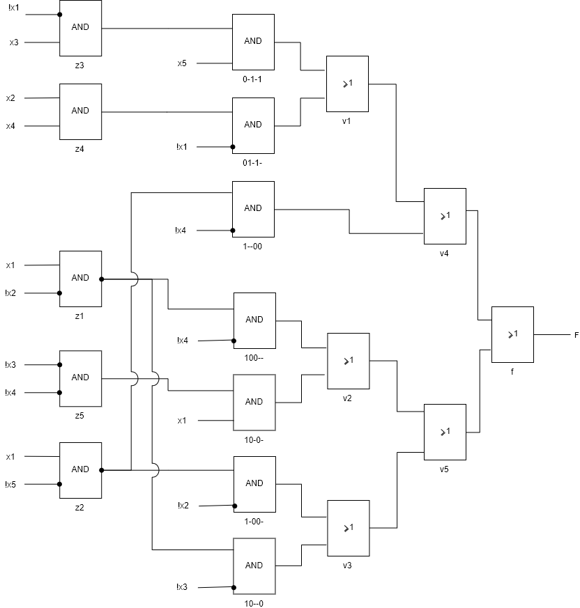
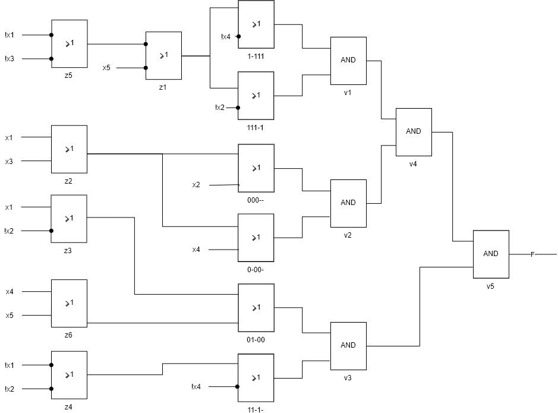

Дана функция $$3<( x_4x_5 + x_1x_2x_3)<8 $$.

Условие неопределенности $$(x_1x_2x_3)=1$$.

Построем таблицу истинности.

 №    $x_1x_2x_3x_4x_5$    f   Функция определена?
---  -------------------  ---  ----------
  1                00000    0  True
  2                00001    0  True
  3                00010    0  True
  4                00011    0  True
  5                00100    -  False
  6                00101    -  False
  7                00110    -  False
  8                00111    -  False
  9                01000    0  True
 10                01001    0  True
 11                01010    1  True
 12                01011    1  True
 13                01100    0  True
 14                01101    1  True
 15                01110    1  True
 16                01111    1  True
 17                10000    1  True
 18                10001    1  True
 19                10010    1  True
 20                10011    1  True
 21                10100    1  True
 22                10101    1  True
 23                10110    1  True
 24                10111    0  True
 25                11000    1  True
 26                11001    1  True
 27                11010    0  True
 28                11011    0  True
 29                11100    1  True
 30                11101    0  True
 31                11110    0  True
 32                11111    0  True

**Получение минимальной дизъюнктивной нормальной формы булевой функции.**

**СДНФ**

№       $x_1x_2x_3x_4x_5$  Простая импликанта?
----  -------------------  ---------------------
[5]                 00100
[6]                 00101
[7]                 00110
[8]                 00111
[11]                01010
[12]                01011
[14]                01101
[15]                01110
[16]                01111
[17]                10000
[18]                10001
[19]                10010
[20]                10011
[21]                10100
[22]                10101
[23]                10110
[25]                11000
[26]                11001
[29]                11100

**Импликанты первого порядка** 

№         $x_1x_2x_3x_4x_5$    Простая импликанта?
--------  -------------------  ---------------------
[5, 6]    0010-
[5, 7]    001-0
[5, 21]   -0100
[6, 8]    001-1
[6, 14]   0-101
[6, 22]   -0101
[7, 8]    0011-
[7, 15]   0-110
[7, 23]   -0110
[8, 16]   0-111
[11, 12]  0101-
[11, 15]  01-10
[12, 16]  01-11
[14, 16]  011-1
[15, 16]  0111-
[17, 18]  1000-
[17, 19]  100-0
[17, 21]  10-00
[17, 25]  1-000
[18, 20]  100-1
[18, 22]  10-01
[18, 26]  1-001
[19, 20]  1001-
[19, 23]  10-10
[21, 22]  1010-
[21, 23]  101-0
[21, 29]  1-100
[25, 26]  1100-
[25, 29]  11-00

**Импликанты второго порядка**

№                 $x_1x_2x_3x_4x_5$    Простая импликанта?
----------------  -------------------  ---------------------
[5, 6, 7, 8]      001--                *
[5, 6, 21, 22]    -010-                *
[5, 7, 21, 23]    -01-0                *
[6, 8, 14, 16]    0-1-1                *
[7, 8, 15, 16]    0-11-                *
[11, 12, 15, 16]  01-1-                *
[17, 18, 19, 20]  100--                *
[17, 18, 21, 22]  10-0-                *
[17, 18, 25, 26]  1-00-                *
[17, 19, 21, 23]  10--0                *
[17, 21, 25, 29]  1--00                *

**Таблица простых импликант**

@latex
  \newcolumntype{g}{>{\columncolor{gray}}c}
  \begin{table}[ht!]
     \centering
      \begin{tabular}{|c|g|g|g|g|g|g|g|g|g|g|c|c|g|g|g|}
        \hline
        Простая импликанта   & 11   & 12   & 14   & 15   & 16   & 17   & 18   & 19   & 20   & 21   & 22   & 23   & 25   & 26   & 29   \\
        \hline
        001--                &      &      &      &      &      &      &      &      &      &      &      &      &      &      &      \\
        -010-                &      &      &      &      &      &      &      &      &      & *    & *    &      &      &      &      \\
        -01-0                &      &      &      &      &      &      &      &      &      & *    &      & *    &      &      &      \\
            \rowcolor{gray}
        0-1-1                &      &      & *    &      & *    &      &      &      &      &      &      &      &      &      &      \\
        0-11-                &      &      &      & *    & *    &      &      &      &      &      &      &      &      &      &      \\
            \rowcolor{gray}
        01-1-                & *    & *    &      & *    & *    &      &      &      &      &      &      &      &      &      &      \\
            \rowcolor{gray}
        100--                &      &      &      &      &      & *    & *    & *    & *    &      &      &      &      &      &      \\
            \rowcolor{gray}
        10-0-                &      &      &      &      &      & *    & *    &      &      & *    & *    &      &      &      &      \\
            \rowcolor{gray}
        1-00-                &      &      &      &      &      & *    & *    &      &      &      &      &      & *    & *    &      \\
            \rowcolor{gray}
        10--0                &      &      &      &      &      & *    &      & *    &      & *    &      & *    &      &      &      \\
            \rowcolor{gray}
        1--00                &      &      &      &      &      & *    &      &      &      & *    &      &      & *    &      & *    \\
        \hline
      \end{tabular}
      \end{table}
@/latex

$( \overline x_1 x_2 x_5 ) \lor ( \overline x_1 x_2 x_4 ) \lor ( x_1\overline x_2\overline x_3 ) \lor ( x_1\overline x_2\overline x_4 ) \lor ( x_1\overline x_3\overline x_4 ) \lor ( x_1\overline x_2\overline x_5 )  \lor ( x_1\overline x_4\overline x_5 )$

|         | $x_1$ | $\overline x_1$ | $x_2$ | $\overline x_2$ | $x_3$ | $\overline x_3$ | $x_4$ | $\overline x_4$ | $x_5$ | $\overline x_5$ | $z_1$ | $z_2$ | $z_3$ | $z_4$ | $z_5$ |
| :------ | :----: | :--------------: | :----: | :--------------: | :----: | :--------------: | :----: | :--------------: | :----: | :--------------: | :----: | :----: | :----: | :----: | :----: |
| 0-1-1 |       | -              |       |                 | -    |                 |      |                 | *     |                 |      |       | * |       |       |
| 01-1- |       | *              | -   |                 |       |                 | -    |                 |       |                 |  |       |       | *    |       |
| 100-- | -  |                 |       | -             |       | *               |       |                 |       |                 | * |       |       |       |      |
| 10-0- | -   |                 |       | -              |       |                 |       | *              |       |                 | * |      |       |       |       |
| 1-00- | *    |                 |       |                 |       | -              |       | -             |       |                 |       |      |       |       | * |
| 10--0 | -   |                 |       | *               |       |                 |       |                 |       | -            |       | * |      |       |       |
|1--00 | -   |                 |       |                 |       |                 |       | *               |       | -             |       | * |      |       |       |
| $z_1$   | * |                |       | * |      |                 |       |                 |      |                 |       |       |       |       |       |
| $z_2$   | *    |                 |       |                 |       |                 |       |                |       | * |       |       |       |       |       |
| $z_3$   |      | * |       |                 | * |                 |       |                 |       |                |       |       |       |       |       |
| $z_4$   |       |                | *    |                 |       |                 | * |                 |       |                 |       |       |       |       |       |
| $z_5$   |      |                 |       |                |       | * |       | * |       |                 |       |       |       |       |       |

|       | 0-1-1 | 01-1- | 100-- | 10-0- | 1-00- | 10--0 | 1--00 | $v_1$ | $v_2$ | $v_3$ | $v_4$ | $v_5$ |
| ----- | :---: | :---: | :---: | :---: | :---: | :---: | :---: | :-----: | :-----: | :-----: | :-----: | :-----: |
| $f$   |   +   |   +   |   +   |   +   |   +   |   +   |   +   | -     | -     | -     | * | *    |
| $v_1$ |   *   | * |       |       |       |       |       |       |       |       |       |       |
| $v_2$ |       |      |   *   | * |       |       |       |       |       |       |       |       |
| $v_3$ |       |       |       |      |   *   | * |       |       |       |       |       |       |
| $v_4$ |       |       |       |       |       |      |   *   | * |       |       |       |       |
| $v_5$ |       |       |       |       |       |       |       |      | *    | * |       |       |

**Получение минимальной конъюнктивной нормальной формы булевой функции.**

В СКНФ все конституенты определены

№       $x_1x_2x_3x_4x_5$  Простая импликанта?
----  -------------------  ---------------------
[1]                 00000
[2]                 00001
[3]                 00010
[4]                 00011
[9]                 01000
[10]                01001
[13]                01100
[24]                10111
[27]                11010
[28]                11011
[30]                11101
[31]                11110
[32]                11111

**Импликанты 1 порядка**

№         $x_1x_2x_3x_4x_5$    Простая импликанта?
--------  -------------------  ---------------------
[1, 2]    0000-
[1, 3]    000-0
[1, 9]    0-000
[2, 4]    000-1
[2, 10]   0-001
[3, 4]    0001-
[9, 10]   0100-
[9, 13]   01-00                *
[24, 32]  1-111                *
[27, 28]  1101-
[27, 31]  11-10
[28, 32]  11-11
[30, 32]  111-1                *
[31, 32]  1111-

**Импликанты 2 порядка**

№                 $x_1x_2x_3x_4x_5$    Простая импликанта?
----------------  -------------------  ---------------------
[1, 2, 3, 4]      000--                *
[1, 2, 9, 10]     0-00-                *
[27, 28, 31, 32]  11-1-                *

**Таблица простых импликант**

\begin{table}[ht!]
    \centering
\begin{tabular}{|c|g|g|g|g|g|g|g|g|g|g|g|g|g|}
\hline
 Простая импликанта   & 1   & 2   & 3   & 4   & 9   & 10   & 13   & 24   & 27   & 28   & 30   & 31   & 32   \\
\hline
  \rowcolor{gray}
 01-00                &     &     &     &     & *   &      & *    &      &      &      &      &      &      \\
  \rowcolor{gray}
 1-111                &     &     &     &     &     &      &      & *    &      &      &      &      & *    \\
  \rowcolor{gray}
 111-1                &     &     &     &     &     &      &      &      &      &      & *    &      & *    \\
  \rowcolor{gray}
 000--                & *   & *   & *   & *   &     &      &      &      &      &      &      &      &      \\
  \rowcolor{gray}
 0-00-                & *   & *   &     &     & *   & *    &      &      &      &      &      &      &      \\
  \rowcolor{gray}
 11-1-                &     &     &     &     &     &      &      &      & *    & *    &      & *    & *    \\
\hline
\end{tabular}
\end{table}

|       | $x_1$ | $\overline x_1$ | $x_2$ | $\overline x_2$ | $x_3$ | $\overline x_3$ | $x_4$ | $\overline x_4$ | $x_5$ | $\overline x_5$ | $z_1$ | $z_2$ | $z_3$ | $z_4$ | $z_5$ | $z_6$ |
| :---- | :----: | :--------------: | :----: | :--------------: | :----: | :--------------: | :----: | :--------------: | :----: | :--------------: | :----: | :----: | ----- | ----- | ----- | ----- |
| 1-111 |       | -             |       |                |       | -             |       | * |       | -             | *    |       |       |       |       |       |
| 111-1 |      | - |      | * |      | - |       |                 |       | - | * |      |      |      |      |      |
| 000-- | -   |                 | *    |                 | - |                 |      |                 |       |                 |       | *    |      |      |      |      |
| 0-00- | -   |                 |       |                 | -   |                 | *    |                 |       |                 |       | * |       |       |       |       |
| 01-00 | - |                |       | - |       |                | - |                | - |                |      |       | * |       |       | * |
| 11-1- |      | - |      | - |       |                 |       | * |      |                 |       |       |  | * |       |       |
| $z_1$ |       | -             |       |                 |       | - |       |                 |       | * |       |       |       |       | * |  |
| $z_2$ | *    |                 |      |                 | * |                 |       |                 |       |                 |       |       |       |       |       |       |
| $z_3$ | * | |  | * | | | | | | | | | | | | |
| $z_4$ |  | * |  | * | | | | | | | | | | | | |
| $z_5$ |  | * |  |  | | * | | | | | | | | | |  |
| $z_6$ |  |  |  |  | |  | * | | * | | | | | | |  |

|       | 1-111 | 111-1 | 000-- | 0-00- | 01-00 | 11-1- | $v_1$ | $v_2$ | $v_3$ | $v_4$ | $v_5$ |
| :----- | :---: | :---: | :---: | :---: | :---: | :---: | :-----: | :-----: | ------ | ------ | ------ |
| $f$   |   +   |   +   |   +   |   +   |   +   |   +   | -     | -     | -   | -   | *  |
| $v_1$ |   *   |   *   |       |       |       |       |       |       |       |       |       |
| $v_2$ |       |       |   *   |   *   |       |       |       |       |       |       |       |
| $v_3$ |       |       |       |       |   *   |   *   |       |       |       |       |       |
| $v_4$ | | | | |  |  | * | * | | | |
| $v_5$ | | | | |  |  |  |  | * | * |  |

